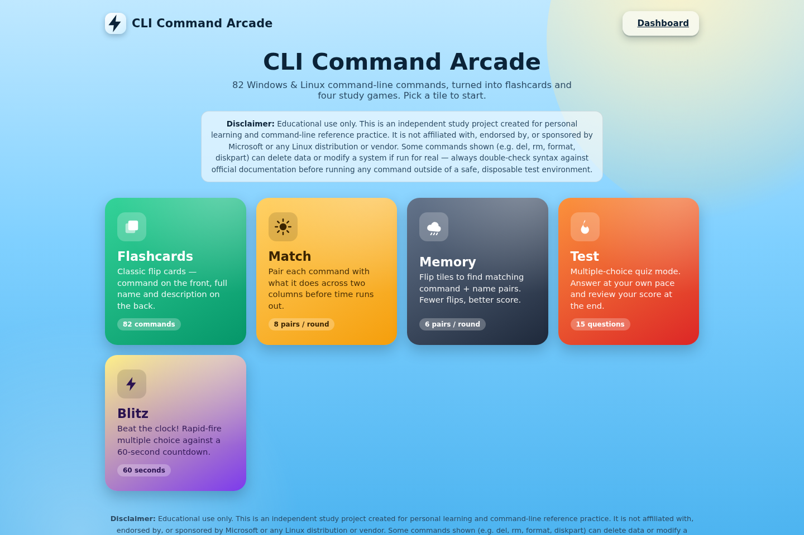
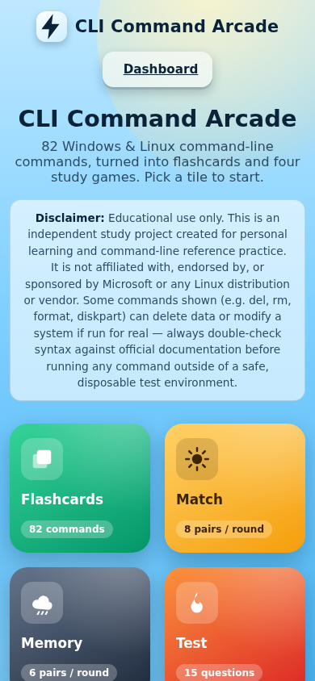
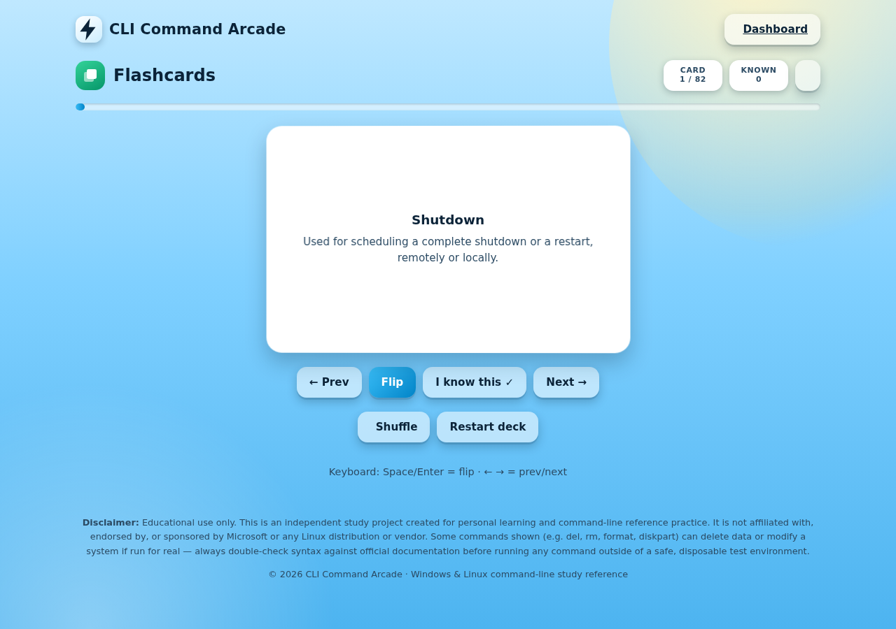
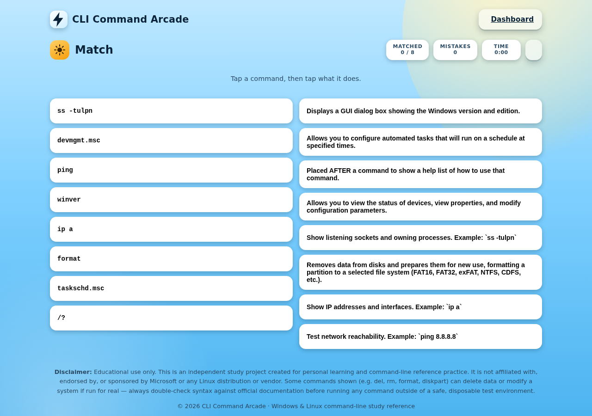
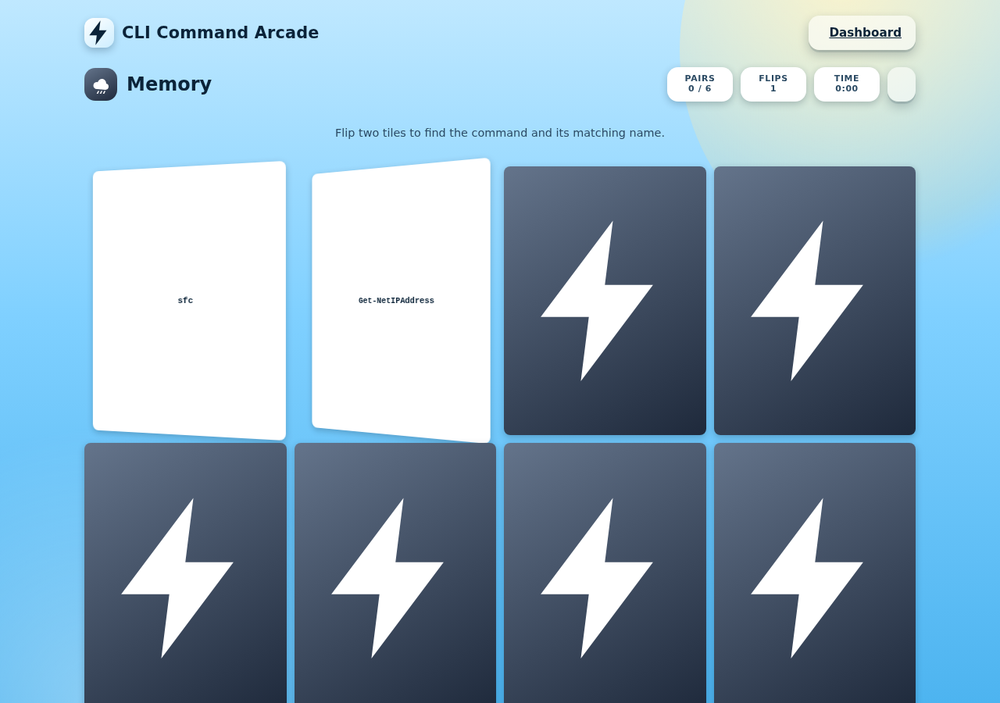
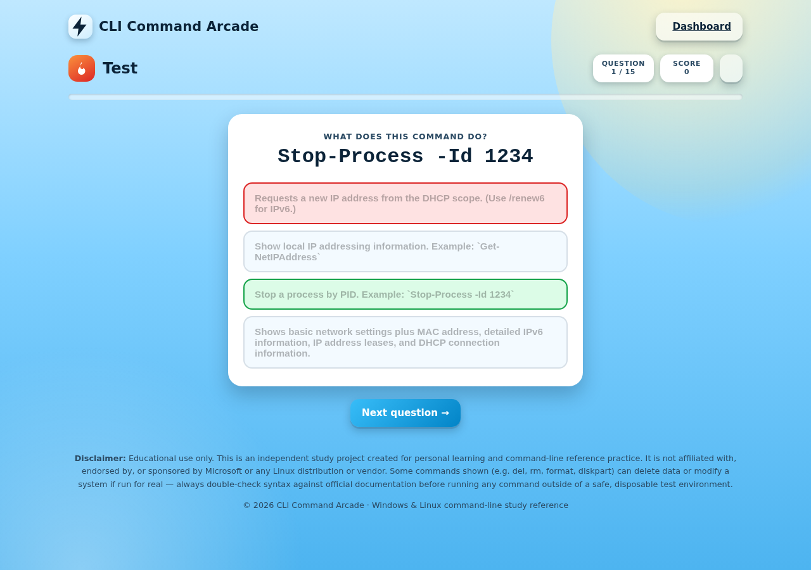
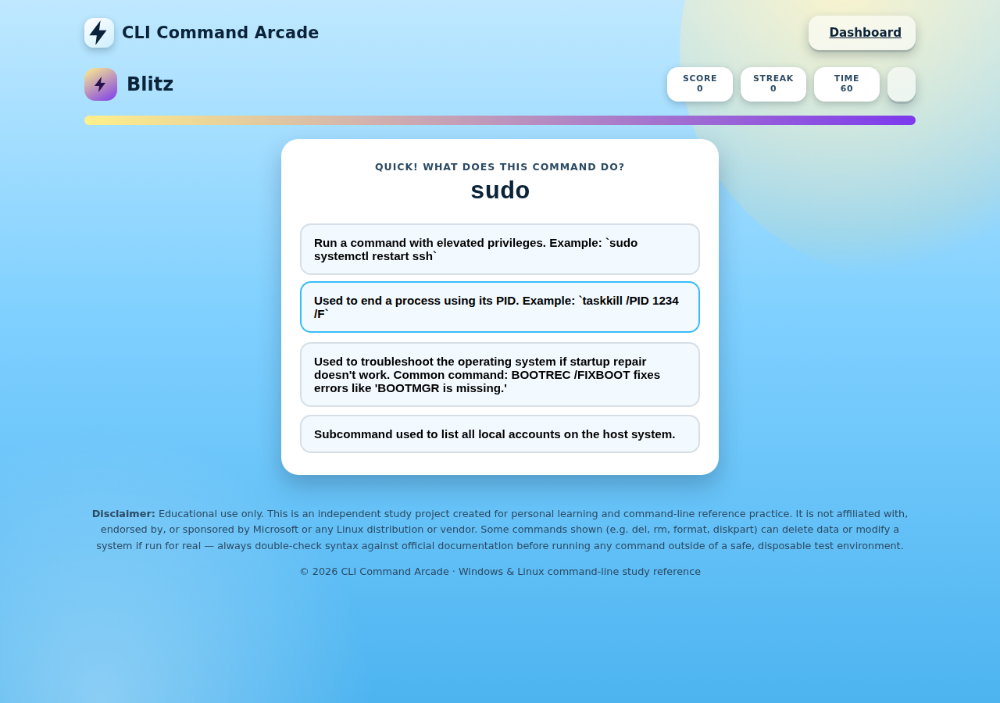
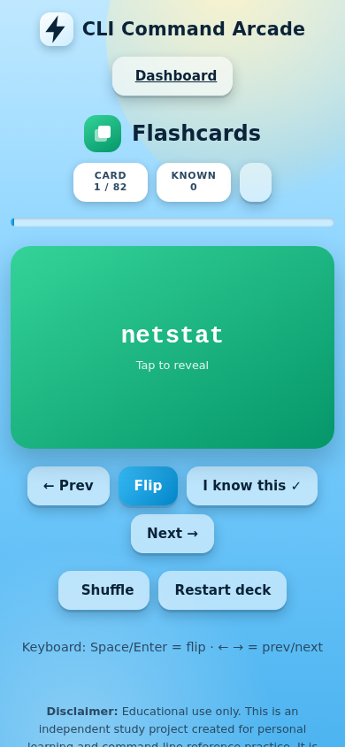

# CLI Command Arcade

A free, static website for studying **82 Windows and Linux command-line commands** — as flashcards and four study games. No build step, no dependencies, no backend. Open `index.html` or host it on GitHub Pages.

> **Disclaimer — Educational use only.** This is an independent study project created for personal learning and command-line reference practice. It is **not affiliated with, endorsed by, or sponsored by Microsoft or any Linux distribution or vendor**. Some commands shown (e.g. `del`, `rm`, `format`, `diskpart`) can delete data or modify a system if run for real — always double-check syntax against official documentation before running any command outside of a safe, disposable test environment.

## Preview

### Dashboard (desktop & mobile)

| Desktop | Mobile |
| --- | --- |
|  |  |

The main page uses a sky-blue canvas. Each tile has its own themed color:

| Tile | Theme | Colors |
| --- | --- | --- |
| Flashcards | Green | `#34d399 → #059669` |
| Match | Sun | `#ffd166 → #f59e0b` |
| Memory | Dark storm cloud | `#64748b → #1e293b` |
| Test | Fire | `#fb923c → #dc2626` |
| Blitz | Lightning | `#fef08a → #7c3aed` |

### Games

| Flashcards | Match |
| --- | --- |
|  |  |

| Memory | Test |
| --- | --- |
|  |  |

| Blitz | Mobile (flashcards) |
| --- | --- |
|  |  |

## Features

- **Flashcards** — classic flip cards: command on the front (monospace, like a terminal), full name and description on the back, with a runnable example where available. Shuffle, step through with keyboard arrows, and mark cards as "known" (saved locally).
- **Match** — tap a command, then tap what it does, across two columns. 8 pairs per round, scored on time and mistakes.
- **Memory** — a concentration/flip grid. Find the 6 command ↔ name pairs in as few flips as possible.
- **Test** — an untimed 15-question multiple-choice quiz with a results screen and a review list of anything missed.
- **Blitz** — a 60-second, rapid-fire multiple-choice sprint. Track your score and best streak.
- **Pause & resume** on every game — pause any time to stop the clock, then resume or jump back to the dashboard.
- **Best scores** are saved locally in your browser (`localStorage`) — no account or server required.
- **Mobile friendly** — responsive layout, large tap targets, tested down to 375px wide with no horizontal scrolling.
- **Light/dark aware** — colors adapt to your system's light/dark mode preference.

## Data source

The 82 entries were merged and de-duplicated from two source PDFs (both included in this repo):

- `Command Cheat Sheet (Windows).pdf` — a narrative Windows Command Prompt reference covering navigation, network tools, disk/system tools, user & policy management, and the MMC snap-in / GUI tool set (Event Viewer, Device Manager, Registry Editor, etc.).
- `Windows Linux Command Line Cheatsheet.pdf` — a structured table covering Windows Command Prompt, Windows PowerShell, and Linux shell/networking commands with short descriptions and runnable examples.

Commands that appeared in both sources (like `ipconfig`, `ping`, `tracert`, `dir`, `cd`) were merged into a single entry, keeping the richer description and adding the example syntax where available. Each entry carries a `category` field (Navigation, Network Tools, Windows PowerShell, Linux Shell Basics, etc.) for potential future filtering. Data lives in [`data/acronyms.json`](data/acronyms.json) / [`js/acronyms-data.js`](js/acronyms-data.js).

## Project structure

```
├── index.html                 # Main tile dashboard (start here)
├── data/acronyms.json         # Source data (82 entries)
├── js/
│   ├── acronyms-data.js       # Same data, embedded as a JS constant
│   └── common.js              # Shared helpers: icons, pause/resume, scoring, page chrome
├── css/styles.css             # Sky-blue theme, tile colors, responsive layout, monospace command styling
├── pages/
│   ├── flashcards.html
│   ├── match.html
│   ├── memory.html
│   ├── test.html
│   └── blitz.html
└── assets/screenshots/        # Preview images used in this README
```

## Running locally

No build tools required — it's plain HTML/CSS/JS.

```bash
# from the project root
python3 -m http.server 8000
# then open http://localhost:8000
```

Opening `index.html` directly by double-clicking also works, since every page uses relative script/stylesheet paths.

## Hosting on GitHub Pages

1. Push this repository to GitHub.
2. In the repo, go to **Settings → Pages**.
3. Under **Build and deployment**, choose **Deploy from a branch**, pick your branch, and set the folder to `/ (root)`.
4. Save — your site will be published at `https://<your-username>.github.io/<repo-name>/`.

## Ideas for future enhancements

A few things that would build nicely on top of this:

- Filter study sessions by category (e.g. only "Linux Networking & Process Commands" or only "Windows PowerShell") using the `category` field already in the data
- An OS toggle (Windows only / Linux only / both)
- A dark-mode toggle switch (colors already adapt to system preference, but a manual switch is a nice touch)
- Filter to "missed cards only" using the Test/Blitz review data
- A copy-to-clipboard button on the flashcard back for the example command
- Sound effects / haptic feedback toggle
- Export/import progress as a JSON file to move between devices

## License / disclaimer

This project is provided as-is for personal, educational use. Windows and PowerShell are trademarks of Microsoft Corporation; Linux is a trademark of Linus Torvalds. This project is an independent study aid and is not affiliated with, endorsed by, or sponsored by Microsoft, any Linux distribution, or any vendor mentioned.
